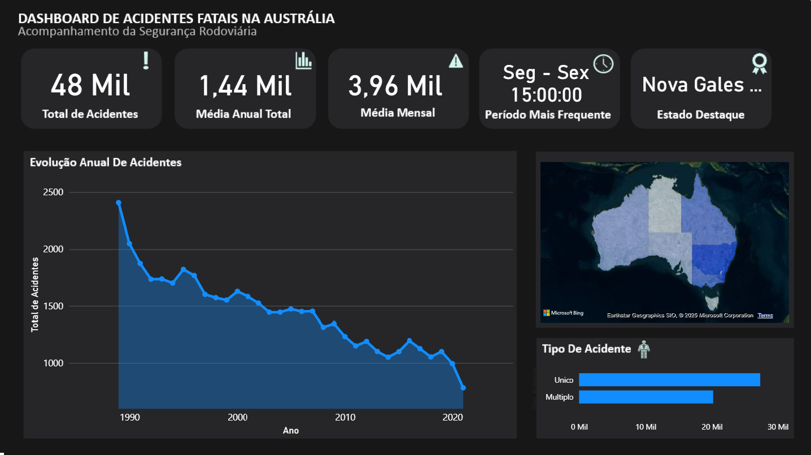

# 🚗 Projeto de Análise de Acidentes Fatais na Austrália

### Um projeto completo de Business Intelligence e Análise de Dados, indo da exploração visual no Power BI até Machine Learning.

##  Objetivo do Projeto

Este projeto tem como objetivo analisar um conjunto de dados de acidentes fatais na Austrália para identificar os principais padrões, fatores de risco e perfis de vítimas, utilizando ferramentas de BI para visualização e técnicas de Machine Learning para uma análise mais profunda.

##  Jornada Analítica

O projeto foi estruturado em um fluxo claro, focado em transformar dados brutos em uma ferramenta de decisão.

**1️⃣ Etapa 1: Estruturação e Limpeza dos Dados (ETL)**
* Extração dos dados brutos e tratamento rigoroso com Power Query e Python/Pandas para garantir a qualidade da análise.

**2️⃣ Etapa 2: Criação do Dashboard e Análise Visual (Power BI)**
* Desenvolvimento de um dashboard completo e interativo no Power BI para permitir a exploração visual dos dados e a descoberta de insights iniciais.

**3️⃣ Etapa 3: Validação com Análise Avançada (Machine Learning)**
* Como complemento, foram aplicadas técnicas de clusterização (K-Means) para descobrir e validar segmentos de acidentes com características similares.

## Tecnologias Utilizadas
* **Power BI & Power Query:** Ferramenta principal para ETL e criação do dashboard.
* **Python:** Linguagem principal para a análise de dados.
* **Bibliotecas:** Pandas, Scikit-learn, Matplotlib, Seaborn.
* **Git & GitHub:** Para versionamento e documentação do projeto.

##  Principais Insights
* O dashboard no Power BI revelou os horários e dias da semana com maior incidência de acidentes.
* A análise de Machine Learning validou que o **Tipo de Usuário da Via** (motorista, pedestre) e o **Gênero** são fatores cruciais para definir o perfil de um acidente.
* Foram descobertos 4 perfis distintos de acidentes, incluindo um segmento específico para ciclistas e perfis noturnos com alta incidência de pedestres.

## 🚀 Como Executar
1.  **Dashboard:** O arquivo `.pbix` na pasta `/powerbi` pode ser aberto com o Power BI Desktop.
2.  **Análise de Machine Learning:** Os Notebooks na pasta `/Data` podem ser executados em um ambiente Python com as bibliotecas listadas.
